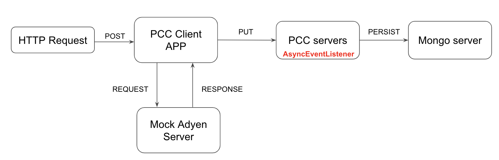

## PivotalCloudCache-Workshop

This workshop will provide developers with hands on experience in building Pivotal Cloud Cache(PCC) clients using Spring Data GemFire (SDG), Spring Data REST, Spring Cloud and Spring Boot. In this session we'll be implementing a Payment Services App backed by Pivotal Cloud Cache and MongoDB. Session includes presentations, demos and hands on labs.



#### Agenda:

* Session 1: Pivotal Cloud Cache (PCC) Essentials

* Session 2: Provisioning PCC Cluster and Developer Access
	** Lab 01: Installation & Developer setup

* Session 3:  AA Payment Services + PCC

* Session 4: Developer Essentials

* Session 5: Access Patterns

* Session 6: Building Spring Boot App with PCC
	** Lab 02 - Develop Spring Boot App for Payment Services API

* Session 7: Eventing and Server Side 
	** Lab 03: In-line caching, PCC Cache Loaders

* Session 8: Pivotal Cloud Cache Active-Active geo replication

#### Payment App Authorize: 

http://payment-services-api-client.xyz.cf-app.com/authorize

```
curl -X POST -d @authorize.txt http://payment-services-api-client.xyz.cf-app.com/authorize --header "Content-Type: application/json
```
#### Payment App Capture: 

http://payment-services-api-client.xyz.cf-app.com/capture

```
curl -X POST -d @capture-payment.txt http://pcc-inline-caching-client-rested-lynx.apps.chowchilla.cf-app.com/capture --header "Content-Type: application/json"
```
